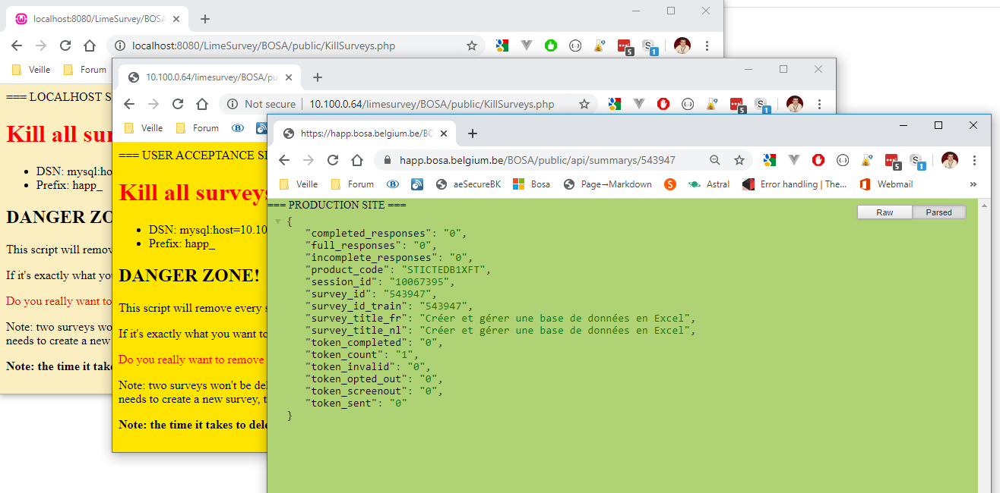

<!-- This file has been generated automatically by the following script -->
<!-- C:\Christophe\Repository\writing-documentation\concat-md\concat-md.ps1 -->
<!-- So don't modify this file manually but run the tool once more instead -->

<!-- Last refresh date: 2020-04-25 10:54:08 -->

<!-- below, content of ./index.md -->

# Chrome tips


<!-- table-of-contents - start -->
* [Addons](#addons)
    * [Stylish - Custom themes for any website](#stylish-custom-themes-for-any-website)
<!-- table-of-contents - end -->

<!-- below, content of ./addons/readme.md -->

## Addons

<!-- below, content of ./addons/stylish/index.md -->

### Stylish - Custom themes for any website

> https://chrome.google.com/webstore/detail/stylish-custom-themes-for/fjnbnpbmkenffdnngjfgmeleoegfcffe?hl=en

When working with different tabs in the browser for the development site `DEV`, the test site `UAT` and the production site `PROD`, it can quickly become confusing to know which tab corresponds to which environment. Especially when you do something dangerous such as deleting records, launching batches, ...

Are you really sure that the site displayed is that of the test site? Even when the URL is just an IP?

Thanks to [Stylish](https://chrome.google.com/webstore/detail/stylish-custom-themes-for/fjnbnpbmkenffdnngjfgmeleoegfcffe?hl=en)



The configuration is just CSS so, f.i., for the UAT sites (regex based on the URL), we can define something like:

```css
body {
    background: #FFE400;
}

body::before {
    content: "=== USER ACCEPTANCE SITE ===";
}
```

Same for PROD URLs.
